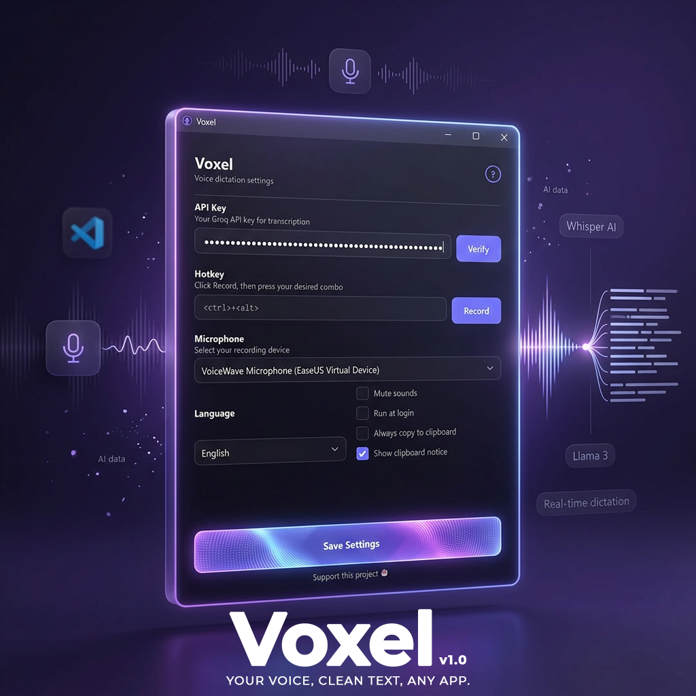

<div align="center">



# 🎙️ Voxel

### Hold a hotkey. Speak. Clean text appears wherever your cursor is.

### Say bye bye to [WisprFlow](https://wisprflow.ai/) 👋

[](../../releases)
[](#-install-macos)
[](https://python.org)
[](LICENSE)

<br>

**Free & open-source voice dictation for Windows & macOS**
<br>
Powered by Groq Whisper + Llama 3. No subscriptions, no cost.

<br>


</div>

---

## 🤔 Why Voxel exists

[WisprFlow](https://wisprflow.ai/) is a great voice dictation tool, but it costs money. Voxel does the same thing for **free**.

If you use **Claude Code in VS Code** (or any AI coding extension), you lose the ability to talk via mic. Voxel brings it back. Hold a hotkey, speak, and your cleaned-up text gets pasted right into the chat, the terminal, or wherever your cursor is.

Windows has built-in voice typing (`Win+H`), but it produces messy, unedited text. You still have to go back and fix grammar, remove filler words, and add punctuation. That defeats the purpose.

Voxel fixes this by running your speech through **two AI steps**:

> 🎤 **Whisper** (speech-to-text) - transcribes your voice accurately
>
> ✨ **Llama 3** (text cleanup) - removes filler words, fixes grammar, keeps your tone

The result: you speak naturally, and clean text appears. **No editing needed.**

### Voxel vs WisprFlow

| | Voxel | WisprFlow |
|---|---|---|
| Price | **Free forever** | $8/mo+ |
| Open source | Yes | No |
| AI cleanup | Yes (Groq Llama 3) | Yes |
| Works in any app | Yes | Yes |
| Customizable hotkey | Yes | Yes |
| Offline mode | Yes (local Whisper) | No |
| Dictation history | Yes | Yes |
| Custom voice commands | Yes | Yes |
| Multiple dictation modes | Yes (5 built-in) | Yes |
| Per-app auto profiles | Yes | Yes |
| Undo last dictation | Yes | No |
| Statistics dashboard | Yes | Yes |
| No account required | Just a free Groq API key | Requires account + payment |
| Windows + macOS | Yes | Yes |

---

## ✨ Features

### Core
- 🎙️ **Push-to-talk** - hold hotkey, speak, release, get clean text
- ✨ **AI text cleanup** - removes "um", "uh", fixes grammar, adds punctuation
- 🌐 **Works in any app** - Chrome, VS Code, Slack, Word, Discord, Notepad
- ⌨️ **Customizable hotkey** - set any combo you like
- 🎤 **Mic selector** - choose your recording device
- 🌍 **Auto-detect language** - or pick from 9 languages

### Smart Features
- 📚 **Dictation History** - every transcription saved, searchable
- 🎭 **5 Dictation Modes** - Default, Professional Email, Casual, Code Comments, Technical
- 🗣️ **Voice Commands** - say "sign off" → insert your signature template
- ↩️ **Undo Last Dictation** - made a mistake? Ctrl+Shift+Z to revert
- 📊 **Statistics Dashboard** - track your usage and time saved
- 🪄 **Auto-switch profile per app** - use "Professional" in Outlook, "Code" in VS Code
- 💾 **Offline Mode** - use local Whisper model, no internet needed

### Polish
- 🎨 **Dark themed UI** with indigo accents
- 🔊 **Audio feedback** (or mute if you prefer)
- 📋 **Clipboard fallback** - copies text if no text field is focused
- 📋 **Always copy to clipboard** option
- 🔒 **Privacy-focused** - your API key never leaves your machine

---

## ⚡ How it works

```
1. 🟢 Hold your hotkey (default: Ctrl+Shift+Space)
2. 🎙️ Speak naturally - say "um" and "like" all you want
3. 🔴 Release the hotkey
4. ✅ Clean, polished text is pasted into whatever app you're using
```

Works with **any app** - Chrome, VS Code, Word, Slack, Discord, Notepad, you name it.

---

## ⏱️ Recording limit

Groq's free tier has a limit on audio length per request. If you hit it, just **release the hotkey and press it again** to start a new recording. It's seamless - you won't lose anything. For most dictation (emails, messages, code comments), you'll never hit the limit.

---

## 🔑 Getting a Groq API Key (free)

| Step | Action |
|------|--------|
| 1 | Go to [console.groq.com](https://console.groq.com) |
| 2 | Sign up for a free account (Google/GitHub sign-in works) |
| 3 | Go to **API Keys** in the sidebar |
| 4 | Click **Create API Key** |
| 5 | Copy the key (starts with `gsk_`) |
| 6 | Paste it into Voxel's settings when you first launch |

> 💡 No credit card. No trial period. Just free.

---

## 🪟 Install (Windows)

### Option 1: Installer
Download **`Voxel_Setup.exe`** from [📦 Releases](../../releases), run it, done.

### Option 2: From source
```bash
git clone https://github.com/draxctrl/Voxel.git
cd Voxel
pip install -r requirements.txt
python -m src.main
```

---

## 🍎 Install (macOS)

```bash
git clone https://github.com/draxctrl/Voxel.git
cd Voxel/BudgetWhisper-mac
chmod +x setup_mac.sh
bash setup_mac.sh
bash run.sh
```

> ⚠️ macOS will ask for **Microphone**, **Accessibility**, and **Input Monitoring** permissions - say yes to all.

Default hotkey on Mac: `Cmd+Shift+Space`

---

## ⚙️ Settings

Right-click the tray icon to access Settings, History, or Statistics. Inside Settings:

| Setting | Description |
|---------|-------------|
| 🔑 **API Key** | Your Groq API key |
| ⌨️ **Hotkey** | Customizable push-to-talk key combo |
| ↩️ **Undo hotkey** | Key combo to undo last dictation |
| 🎭 **Dictation Mode** | 5 built-in cleanup styles + custom profiles |
| 🗣️ **Voice Commands** | Define trigger phrases that expand to templates |
| 🎤 **Microphone** | Choose your recording device |
| 🌍 **Language** | Auto-detect or pick from 9 languages |
| 🔇 **Mute sounds** | Disable the chime after recording |
| 🪄 **Auto-switch profile per app** | Use different modes for different apps |
| 💾 **Offline mode** | Use local Whisper model instead of API |
| 📋 **Always copy to clipboard** | Keep text on clipboard after paste |
| 💬 **Show clipboard notice** | Notification when text copied instead of pasted |

---

## 🛠️ Tech stack

| Component | Technology |
|-----------|-----------|
| Language | Python 3.13+ |
| AI Backend | Groq API (free) - Whisper Large v3 + Llama 3.3 70B |
| Offline Transcription | faster-whisper (CTranslate2) |
| UI Framework | PyQt6 |
| Hotkey Listener | pynput |
| Audio | PyAudio |
| System Tray | pystray |
| Storage | SQLite (history) + JSON (config) |
| Packaging | PyInstaller + NSIS |

---

<div align="center">

### 💜 Support this project

If Voxel saves you time, consider supporting development:

[](https://paypal.me/draxctrl)

MIT License

</div>
